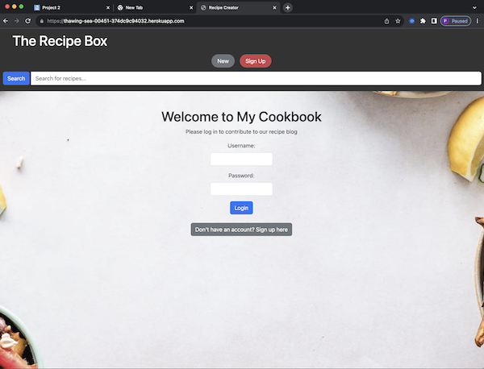
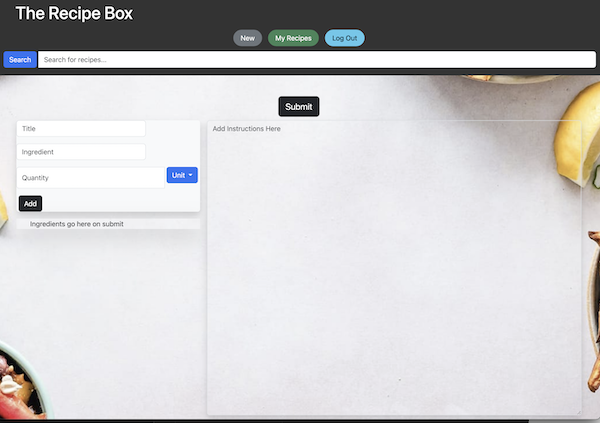
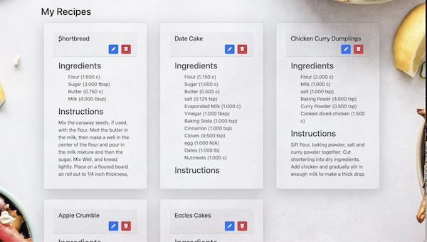
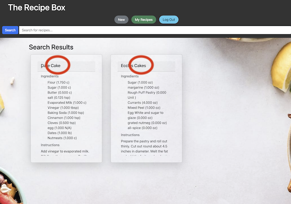

## RecipeProject  

# Description
    - We created this to explore the inner working of back-end development and how it could solve the problem of storing recipes on a server.
    - This app gives a solution to the piles of cookbooks we have laying around. The fact that we only use 1 or 2 recipes from each creates a huge storage problem. Grandma's recipe cards are pretty old, yellowed and covered in stains. Let's put them all in one place.
    - We can also search and be inspired by other users. With the ability to search for recipes by one word in a Recipe title.
    - This project has created a bases for understanding Model, View, and Controller and how they work together. There are a lot of moving parts to consider.  

## &nbsp;&nbsp;&nbsp;  Installation  
    Download repository, enter "npm i", run mysql and enter source schema.sql; once entered quit out of it and enter "nodemon server.js" Once it says listening you can view thru your browser by entering https://127.0.0.1:3006.

    Deployment is listed below.

## &nbsp;&nbsp;&nbsp;  Usage  
    First create an account and then login. Once entered You can add recipes by clicking on the new recipe button. If you want to search recipes with a particular item in it you can enter the particular word for example chicken, it will give you yours and anyone elses that has chicken in the title. You are allowed to delete your own recipes as needed. Log Out when completed.

images to show usage:  

## &nbsp;&nbsp;&nbsp;  Contributing  
    Major writers: Mahoud Nabil, Pam Willis and Michael Pigott.
    Assistance has been given from Carl Vega - TA, Juan Delgado - Tutor, AskBCs, and Chat GPT.
    Login and Logout code can be referenced from Module 14 mini project.
 
    

# Table of Contents
- [Installation](#installation)
- [Usage](#usage)
- [License](#license)
- [Contributing](#contributing)
- [Tests](#tests)
- [Questions](#questions)
## Deployment

 This can be viewed by:  
[Click here](https://https://thawing-sea-00451-374dc9c94032.herokuapp.com/)

# License
The MIT License  https://opensource.org/licenses/MIT

# Questions
please contact me with any questions:  
GitHub: https://github.com/MichaelPigott  
Email: Mahmoudmuhamednabil@gmail.com (Mahoud Nabil)  
Email: pwillisop@yahoo.com (Pam Willis)  
Email: michaelepigott@gmail.com (Michael Pigott)
